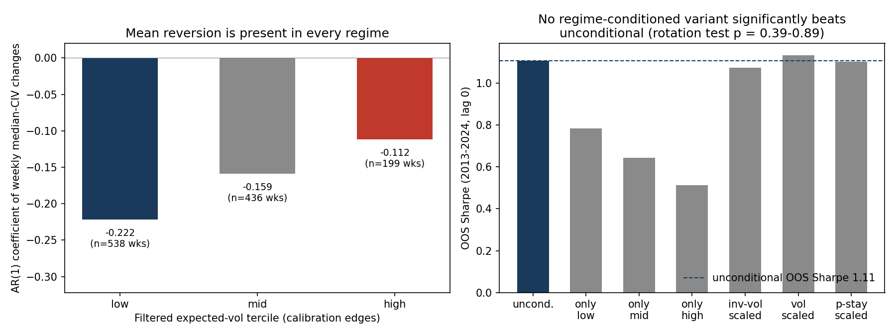
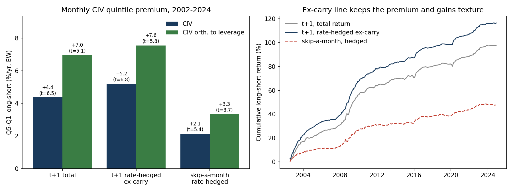
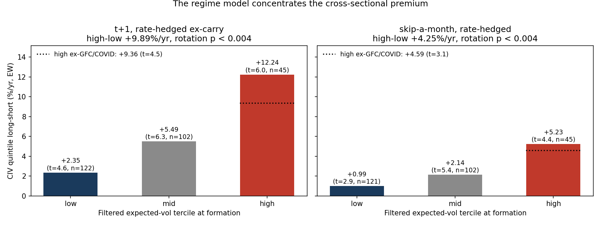

# markov_vol: Markov-Switching Credit-Implied Volatility

This project estimates a discrete Markov-switching model on credit-implied volatility (CIV) portfolios constructed from WRDS corporate bond and equity data. The model captures regime shifts in aggregate credit risk and produces state-filtered CIV estimates that are mean-reverting at daily frequency -- a property absent from raw equity returns. Two extensions test what the model is good for: it cannot time the mean-reversion signal (which turns out to be regime-invariant), but it strongly concentrates the cross-sectional CIV premium in bond returns (see "Does the regime matter?" and "The cross-section of CIV" below).

## Correction (August 2026)

The original version of this project inverted CIV from `t_spread` in WRDS Bond Returns. That variable is a bid/ask (transaction-cost) spread, not a credit spread. All results have been rebuilt on corrected credit spreads (end-of-month bond yield minus the maturity-matched treasury yield), the same corrected panel used in the companion [civ-bond-replication](https://github.com/sjmagill01/civ-bond-replication) project. The rebuild also fixed an identifier bug that had silently dropped about two thirds of issuers (the permno-to-cusip map kept one arbitrary cusip per permno); the daily panel grew from 1.5M rows / 920 issuers to 6.4M rows / 3,267 issuers.

The weekly mean-reversion finding survives the correction essentially unchanged at lag 0 (Sharpe 1.05 vs 0.98 before) and weakens at lag 1 (0.35 vs 0.48). One narrative changed: on the contaminated data the daily signal died under a skip-a-day test and was written off as microstructure. On corrected spreads the daily signal retains most of its strength under a one-day lag; the earlier one-day collapse was, at least in part, the bid/ask bounce embedded in the contaminated input itself.

## Key Result

Weekly CIV mean-reversion (position = minus the sign of last week's change in the median CIV across 20 leverage x maturity portfolios) delivers:

- **Full-sample Sharpe 1.05** (2002-2024, 1,174 weeks), permutation p = 0.0001 (10,000 shuffles of the weekly changes; no shuffle reached the observed Sharpe)
- **Sharpe 0.35 under a one-week execution lag** (34% retention), permutation p = 0.046
- **Positive in 29 of 34 rolling walk-forward windows** (260-week calibration, 52-week test, 26-week roll; test windows overlap by 50%); mean window Sharpe 1.32


### Honest caveats

- **All Sharpes are gross of transaction costs.** The P&L is measured in CIV bps; converting to tradeable spread P&L requires the Merton vega (~0.07), a ~14x compression. In spread space the strategy is roughly breakeven after 2bp CDX-style costs (see `unit_analysis.py`).
- The one-week-lag Sharpe of 0.35 is marginal: permutation p = 0.046, just inside conventional significance. The strategy's economic value is concentrated at lag 0, which assumes execution at the same close that generates the signal.
- The Markov-switching model itself is **descriptive**: it characterizes regime structure in CIV levels (R-squared via state-dependent intercepts). The trading signal is model-free (sign of last change) and does not use the fitted model.
- Walk-forward test windows overlap by 50%, so the 34 window Sharpes are not independent observations.
- An earlier daily OOS Sharpe of 2.75 (pre-correction) was retracted after a skip-a-day test; it appears nowhere in current results.

## The Model

A seven-state Markov chain (BIC-selected over {3, 5, 7}) on the common CIV level, estimated with the Hamilton filter on 20 leverage x maturity portfolios; portfolio intercepts absorb the cross-sectional smirk. Monthly R-squared 0.985; freezing the calibrated parameters and filtering daily 2024 data out of sample gives R-squared 0.974.


The cross-section the intercepts absorb is the CIV smirk: implied asset volatility falls monotonically in leverage at every maturity.


## Does the regime matter? (a clean negative)

The natural follow-up question: if the model identifies vol regimes, can it improve the trading signal? The test is fully causal. The seven-state model is estimated once on 2002-2012 weekly data, Hamilton **filtered** (never smoothed) probabilities are run forward over all 1,175 weeks, and the filtered expected vol is bucketed into terciles with edges frozen on the calibration sample.

The answer is no, twice over:

1. **Mean reversion is present in every regime.** The AR(1) coefficient of weekly median-CIV changes is negative in all three terciles (low -0.222, mid -0.159, high -0.112). If anything it is mildly stronger in calm regimes, the opposite of a stress-driven story.
2. **No regime-conditioned strategy beats the unconditional signal.** Trading only in selected regimes, or scaling positions by filtered vol or by state persistence, leaves the OOS Sharpe statistically indistinguishable from the unconditional 1.11 (circular-rotation test on the Sharpe difference: p = 0.39-0.89 across variants). The same holds at a one-week lag.



The honest summary: the model *describes* the regime structure of credit-implied volatility but does not *time* the mean-reversion signal. The signal is regime-invariant.

## The cross-section of CIV

The time-series signal trades the median CIV level. A separate question is whether CIV ranks *issuers*: do high-CIV bonds outperform low-CIV bonds?

**Weekly, across the 20 portfolios** (`cross_section_mr.py`): a rank-weighted long-short on last week's CIV changes earns a Sharpe of 0.85 at a one-week lag (permutation p = 0.0005, positive in 19 of 23 years). The lag-0 Sharpe of 3.86 is inflated by construction (the portfolios are LOWESS-interpolated, so week-t estimation noise reverts mechanically) and is not the headline. Correlation with the time-series P&L is only +0.19, so this is a distinct effect.

**Monthly, at the issuer level** (`cross_section_monthly.py`): CIV quintile sorts against actual bond returns (WRDS Bond Returns, 2002-2024, about 1,900 issuers per month). Because corporate bond returns are dominated by carry, every sort is run on total returns *and* on rate-hedged ex-carry returns (return minus riskless carry, minus spread carry, with the duration-times-treasury-shift mark-to-market removed), so the premium cannot be a deterministic yield drip in disguise:

| Long-short (Q5-Q1, EW) | t+1 | skip-a-month |
|---|---|---|
| CIV, total return | +4.4%/yr (t = 6.5) | +2.3 (t = 4.9) |
| CIV, rate-hedged ex-carry | +5.2%/yr (t = 6.8) | +2.1 (t = 5.4) |
| CIV orthogonalized to leverage, rate-hedged | +7.6%/yr (t = 5.8) | +3.3 (t = 3.7) |

Fitted CIV is empirically downward-sloping in leverage (the smirk), so a raw CIV sort is partly a short-leverage sort; orthogonalizing CIV to leverage month by month isolates the signal and raises the premium, the same pattern as in the companion repo's ventile sorts. The premium survives carry removal, value-weighting (+4.0, t = 4.8), IG and HY separately, maturity-tercile neutralization, both halves of the sample, a within-month permutation test (p < 0.001), and is positive in 22 of 23 calendar years.

High-CIV issuers also see subsequent spread *tightening* (-8.5 bps/month at t+1, -2.9 skip-a-month), which is what a genuine repricing signal, rather than a carry signal, must predict. Spread measurement noise could fake this (a noisy high spread mechanically "tightens" next month), so the guard is to re-run the sort *within spread quintiles*, where the noise reversal cannot load: the tightening survives, -5.3 bps/month at t+1 (t = -7.0) and -1.4 skip-a-month (t = -3.8).



### The bridge: the regime concentrates the premium

Conditioning the monthly long-short on the *same frozen filtered regimes* that failed to time the time-series signal produces the sharpest result in the project. The cross-sectional premium is strongly regime-dependent and monotone in filtered vol:

| Filtered-vol tercile | t+1 rate-hedged | skip-a-month |
|---|---|---|
| low | +2.4%/yr (t = 4.6) | +1.0 (t = 2.9) |
| mid | +5.5 (t = 6.3) | +2.1 (t = 5.4) |
| high | +12.2 (t = 6.0) | +5.2 (t = 4.4) |

High-minus-low is +9.9%/yr with a circular-rotation p < 0.004 (no rotation of the regime series against the P&L produced a larger gap). Dropping the GFC and COVID windows entirely, the high-regime premium is still +9.4%/yr (t = 4.5), so this is not two crisis episodes in disguise. The leverage-orthogonalized signal concentrates even harder: +3.3%/yr in the low tercile versus +18.5 in the high (t = 5.1), high-minus-low +15.2%/yr, and +14.2 (t = 4.2) ex-crisis.



The two results are two sides of one story. The regime model cannot time *when the aggregate level mean-reverts* (that happens in every state), but it does identify *when holding the high-CIV cross-section is best paid*. That pattern, premium concentrated in high-vol states and monotone in filtered vol, is what compensation for bearing credit risk looks like, not a free lunch.

## Quick Start

```bash
# 1. Pull daily TRACE data (requires WRDS credentials via pgpass.conf)
python markov_vol/fetch_daily_trace.py

# 2. Build daily CIV portfolios from monthly yield spreads + CRSP leverage
python markov_vol/build_daily_civ.py

# 3. Run full estimation + OOS backtest
python markov_vol/run_pipeline.py
```

To run monthly estimation only (no daily data required):

```bash
python markov_vol/run_pipeline.py --monthly-only
```

## Pipeline Description

| Script | Purpose |
|---|---|
| `fetch_daily_trace.py` | Pulls daily bond-level aggregates from WRDS TRACE Enhanced. Server-side GROUP BY minimizes data transfer. Uses half-year chunks with resume support. |
| `build_daily_civ.py` | Constructs daily CIV by combining monthly yield spreads (forward-filled) with daily CRSP-based leverage, then inverting via the Merton model. Aggregates to 20 leverage x maturity portfolios. |
| `run_pipeline.py` | Estimates the Markov-switching model at N_vol = {3, 5, 7} on monthly data (BIC selects), then runs daily out-of-sample evaluation: calibration on 2018-2023, OOS on 2024. Reports strategy Sharpes and R-squared. |
| `src/merton.py` | Pure Python Merton model: spread, vega, Newton-Raphson CIV inversion. |
| `src/markov_transition.py` | Builds volatility grid and transition matrix with mean-reversion. |
| `src/hamilton_filter.py` | Hamilton filter, Kim smoother, and simulation. |
| `src/estimation.py` | Multi-start Nelder-Mead estimation with smart starts anchored to data mean. |
| `src/strategies.py` | OOS trading strategies: CIV mean-reversion, cross-sectional dispersion, leverage spread, stress hedge, equity benchmark. |
| `src/diagnostics.py` | R-squared and other model diagnostics. |
| `src/data_loader.py` | Loads monthly and daily portfolio data with column parsing. |
| `config.py` | Paths, grids, parameter bounds, estimation defaults. |
| `strategy_analysis.py` | Daily strategy definitions tested at lags 0/1/2/5 with autocorrelation diagnostics and an equity benchmark. |
| `weekly_deep_dive.py` | Full development of the weekly signal: full sample, walk-forward, fixed split, per-portfolio. |
| `permutation_test.py` | Significance test: 10,000 shuffles of weekly changes; p = 0.0001 (lag 0), p = 0.046 (lag 1). |
| `unit_analysis.py` | Vega-corrected conversion from CIV bps to spread bps to dollars; model-free Sharpe-based sizing. |
| `make_readme_figures.py` | Regenerates the weekly-signal figure embedded above (cumulative P&L + walk-forward Sharpes). |
| `regime_conditioning.py` | The regime-timing test: causal filtered probabilities, AR(1) by tercile, regime-conditioned strategy variants, circular-rotation inference. |
| `cross_section_mr.py` | Weekly cross-sectional long-shorts across the 20 portfolios (rank, sign, level-z), with lag decay and permutation tests. |
| `cross_section_monthly.py` | Issuer-level monthly CIV quintile sorts against WRDS bond returns: total and rate-hedged ex-carry, raw and leverage-orthogonalized CIV, spread-change prediction with an errors-in-variables guard. |
| `regime_bridge.py` | Conditions the monthly long-shorts on the frozen filtered regimes; tercile means, ex-crisis check, rotation test. |
| `make_writeup_figures.py` | Regenerates figures 5-7 from the results JSONs. |

## Data Sources

| WRDS Table | Frequency | Purpose |
|---|---|---|
| `wrdsapps_bondret.bondret` | Monthly | End-of-month bond yields, maturity, ratings. Credit spread = yield minus maturity-matched treasury (NOT `t_spread`, which is a bid/ask measure; see Correction above). Also monthly bond returns, amounts outstanding, and modified durations for the cross-section sorts. |
| `wrdsapps_bondret.trace_enhanced_clean` | Daily (tick) | Trade-level bond prices/volumes for daily TRACE aggregates. |
| `wrdsapps.bondcrsp_link` | Static | Maps bond issuer CUSIP to CRSP permno. |
| `crsp_a_ccm.ccmxpf_lnkhist` | Static | Maps CRSP permno to Compustat gvkey. |
| `comp.fundq` | Quarterly | Total debt for leverage calculation. |
| `crsp.dsf` | Daily | Equity prices and shares outstanding for daily market cap. |

## Data Availability

None of the WRDS-derived data files are distributed with this repository (WRDS license terms). To reproduce:

1. You need a WRDS subscription covering TRACE, Bond Returns, CRSP, and Compustat.
2. Monthly CIV portfolios (`data/portfolios_wide.parquet`) are produced by a companion pipeline (bond spreads -> Merton-inverted CIV); set `MONTHLY_PORTFOLIOS_PATH` to point at your copy.
3. The daily equity benchmark parquet is optional (`CRSP_DAILY_PATH`); scripts skip it gracefully if absent.

## Credential Safety

This project uses WRDS PostgreSQL access. Credentials are never hardcoded:

- Set the `WRDS_USERNAME` environment variable
- The password is read from `~/.pgpass` (Linux/Mac) or `%APPDATA%\postgresql\pgpass.conf` (Windows)
- No passwords appear in any source file

## Known Pitfalls

See `PITFALLS.md` for 12 documented pitfalls encountered during development, including:

- Why TRACE avg_yield must not be used as a spread (Pitfall 1)
- Why Compustat CUSIP matching requires a permno bridge (Pitfall 2)
- Why smart starts are essential for the optimizer (Pitfall 3)
- Why intercepts raise R-squared from 2.8% to 99.4% (Pitfall 4)

Each pitfall includes what happened, why it was wrong, the correct approach, and how to verify.
