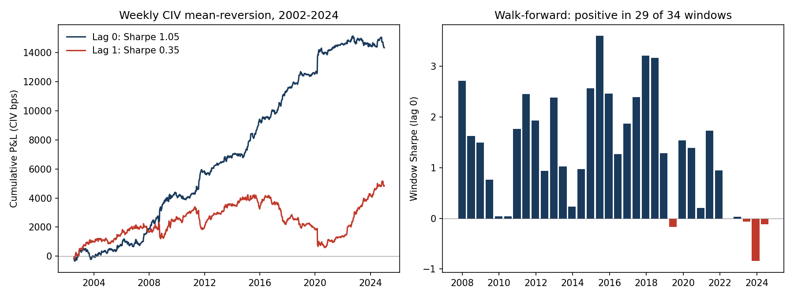
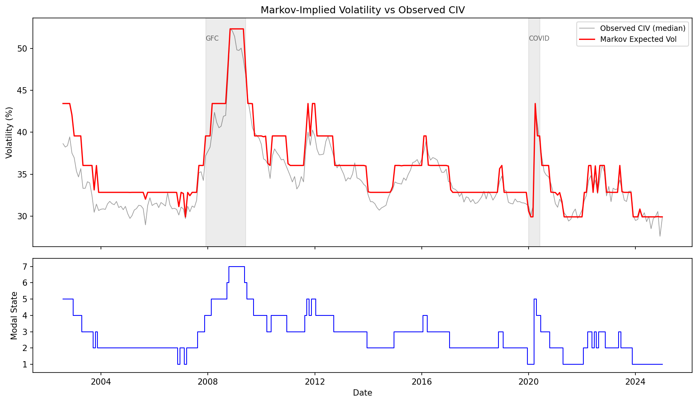
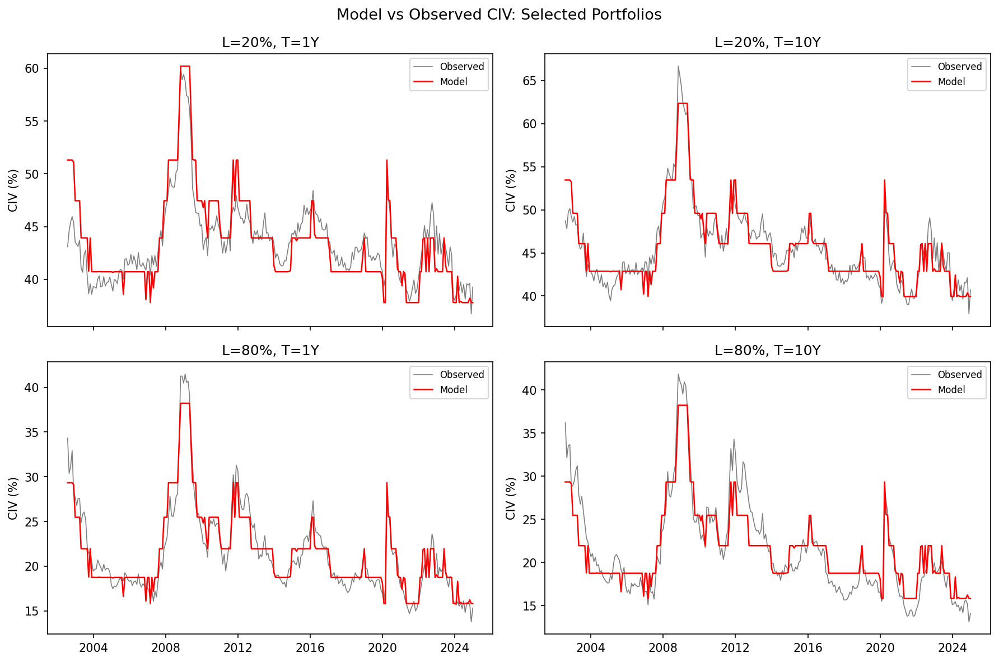
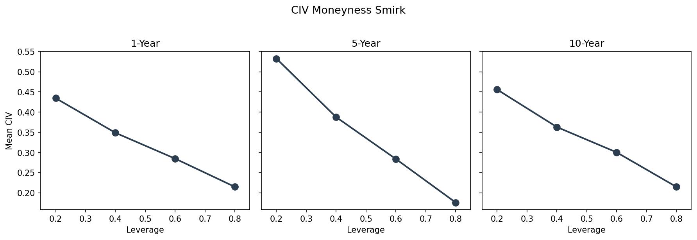

# markov_vol: Markov-Switching Credit-Implied Volatility

This project estimates a discrete Markov-switching model on credit-implied volatility (CIV) portfolios constructed from WRDS corporate bond and equity data. The model captures regime shifts in aggregate credit risk and produces state-filtered CIV estimates that are mean-reverting at daily frequency -- a property absent from raw equity returns.

## Correction (August 2026)

The original version of this project inverted CIV from `t_spread` in WRDS Bond Returns. That variable is a bid/ask (transaction-cost) spread, not a credit spread. All results have been rebuilt on corrected credit spreads (end-of-month bond yield minus the maturity-matched treasury yield), the same corrected panel used in the companion [civ-bond-replication](https://github.com/sjmagill01/civ-bond-replication) project. The rebuild also fixed an identifier bug that had silently dropped about two thirds of issuers (the permno-to-cusip map kept one arbitrary cusip per permno); the daily panel grew from 1.5M rows / 920 issuers to 6.4M rows / 3,267 issuers.

The weekly mean-reversion finding survives the correction essentially unchanged at lag 0 (Sharpe 1.05 vs 0.98 before) and weakens at lag 1 (0.35 vs 0.48). One narrative changed: on the contaminated data the daily signal died under a skip-a-day test and was written off as microstructure. On corrected spreads the daily signal retains most of its strength under a one-day lag; the earlier one-day collapse was, at least in part, the bid/ask bounce embedded in the contaminated input itself.

## Key Result

Weekly CIV mean-reversion (position = minus the sign of last week's change in the median CIV across 20 leverage x maturity portfolios) delivers:

- **Full-sample Sharpe 1.05** (2002-2024, 1,174 weeks), permutation p = 0.0001 (10,000 shuffles of the weekly changes; no shuffle reached the observed Sharpe)
- **Sharpe 0.35 under a one-week execution lag** (34% retention), permutation p = 0.046
- **Positive in 29 of 34 rolling walk-forward windows** (260-week calibration, 52-week test, 26-week roll; test windows overlap by 50%); mean window Sharpe 1.32



### Honest caveats

- **All Sharpes are gross of transaction costs.** The P&L is measured in CIV bps; converting to tradeable spread P&L requires the Merton vega (~0.07), a ~14x compression. In spread space the strategy is roughly breakeven after 2bp CDX-style costs (see `unit_analysis.py`).
- The one-week-lag Sharpe of 0.35 is marginal: permutation p = 0.046, just inside conventional significance. The strategy's economic value is concentrated at lag 0, which assumes execution at the same close that generates the signal.
- The Markov-switching model itself is **descriptive**: it characterizes regime structure in CIV levels (R-squared via state-dependent intercepts). The trading signal is model-free (sign of last change) and does not use the fitted model.
- Walk-forward test windows overlap by 50%, so the 34 window Sharpes are not independent observations.
- An earlier daily OOS Sharpe of 2.75 (pre-correction) was retracted after a skip-a-day test; it appears nowhere in current results.

## The Model

A seven-state Markov chain (BIC-selected over {3, 5, 7}) on the common CIV level, estimated with the Hamilton filter on 20 leverage x maturity portfolios; portfolio intercepts absorb the cross-sectional smirk. Monthly R-squared 0.985; freezing the calibrated parameters and filtering daily 2024 data out of sample gives R-squared 0.974.





The cross-section the intercepts absorb is the CIV smirk: implied asset volatility falls monotonically in leverage at every maturity.



## Quick Start

```bash
# 1. Pull daily TRACE data (requires WRDS credentials via pgpass.conf)
python markov_vol/fetch_daily_trace.py

# 2. Build daily CIV portfolios from monthly yield spreads + CRSP leverage
python markov_vol/build_daily_civ.py

# 3. Run full estimation + OOS backtest
python markov_vol/run_pipeline.py
```

To run monthly estimation only (no daily data required):

```bash
python markov_vol/run_pipeline.py --monthly-only
```

## Pipeline Description

| Script | Purpose |
|---|---|
| `fetch_daily_trace.py` | Pulls daily bond-level aggregates from WRDS TRACE Enhanced. Server-side GROUP BY minimizes data transfer. Uses half-year chunks with resume support. |
| `build_daily_civ.py` | Constructs daily CIV by combining monthly yield spreads (forward-filled) with daily CRSP-based leverage, then inverting via the Merton model. Aggregates to 20 leverage x maturity portfolios. |
| `run_pipeline.py` | Estimates the Markov-switching model at N_vol = {3, 5, 7} on monthly data (BIC selects), then runs daily out-of-sample evaluation: calibration on 2018-2023, OOS on 2024. Reports strategy Sharpes and R-squared. |
| `src/merton.py` | Pure Python Merton model: spread, vega, Newton-Raphson CIV inversion. |
| `src/markov_transition.py` | Builds volatility grid and transition matrix with mean-reversion. |
| `src/hamilton_filter.py` | Hamilton filter, Kim smoother, and simulation. |
| `src/estimation.py` | Multi-start Nelder-Mead estimation with smart starts anchored to data mean. |
| `src/strategies.py` | OOS trading strategies: CIV mean-reversion, cross-sectional dispersion, leverage spread, stress hedge, equity benchmark. |
| `src/diagnostics.py` | R-squared and other model diagnostics. |
| `src/data_loader.py` | Loads monthly and daily portfolio data with column parsing. |
| `config.py` | Paths, grids, parameter bounds, estimation defaults. |
| `strategy_analysis.py` | Daily strategy definitions tested at lags 0/1/2/5 with autocorrelation diagnostics and an equity benchmark. |
| `weekly_deep_dive.py` | Full development of the weekly signal: full sample, walk-forward, fixed split, per-portfolio. |
| `permutation_test.py` | Significance test: 10,000 shuffles of weekly changes; p = 0.0001 (lag 0), p = 0.046 (lag 1). |
| `unit_analysis.py` | Vega-corrected conversion from CIV bps to spread bps to dollars; model-free Sharpe-based sizing. |
| `make_readme_figures.py` | Regenerates the weekly-signal figure embedded above (cumulative P&L + walk-forward Sharpes). |

## Data Sources

| WRDS Table | Frequency | Purpose |
|---|---|---|
| `wrdsapps_bondret.bondret` | Monthly | End-of-month bond yields, maturity, ratings. Credit spread = yield minus maturity-matched treasury (NOT `t_spread`, which is a bid/ask measure; see Correction above). |
| `wrdsapps_bondret.trace_enhanced_clean` | Daily (tick) | Trade-level bond prices/volumes for daily TRACE aggregates. |
| `wrdsapps.bondcrsp_link` | Static | Maps bond issuer CUSIP to CRSP permno. |
| `crsp_a_ccm.ccmxpf_lnkhist` | Static | Maps CRSP permno to Compustat gvkey. |
| `comp.fundq` | Quarterly | Total debt for leverage calculation. |
| `crsp.dsf` | Daily | Equity prices and shares outstanding for daily market cap. |

## Data Availability

None of the WRDS-derived data files are distributed with this repository (WRDS license terms). To reproduce:

1. You need a WRDS subscription covering TRACE, Bond Returns, CRSP, and Compustat.
2. Monthly CIV portfolios (`data/portfolios_wide.parquet`) are produced by a companion pipeline (bond spreads -> Merton-inverted CIV); set `MONTHLY_PORTFOLIOS_PATH` to point at your copy.
3. The daily equity benchmark parquet is optional (`CRSP_DAILY_PATH`); scripts skip it gracefully if absent.

## Credential Safety

This project uses WRDS PostgreSQL access. Credentials are never hardcoded:

- Set the `WRDS_USERNAME` environment variable
- The password is read from `~/.pgpass` (Linux/Mac) or `%APPDATA%\postgresql\pgpass.conf` (Windows)
- No passwords appear in any source file

## Known Pitfalls

See `PITFALLS.md` for 12 documented pitfalls encountered during development, including:

- Why TRACE avg_yield must not be used as a spread (Pitfall 1)
- Why Compustat CUSIP matching requires a permno bridge (Pitfall 2)
- Why smart starts are essential for the optimizer (Pitfall 3)
- Why intercepts raise R-squared from 2.8% to 99.4% (Pitfall 4)

Each pitfall includes what happened, why it was wrong, the correct approach, and how to verify.
